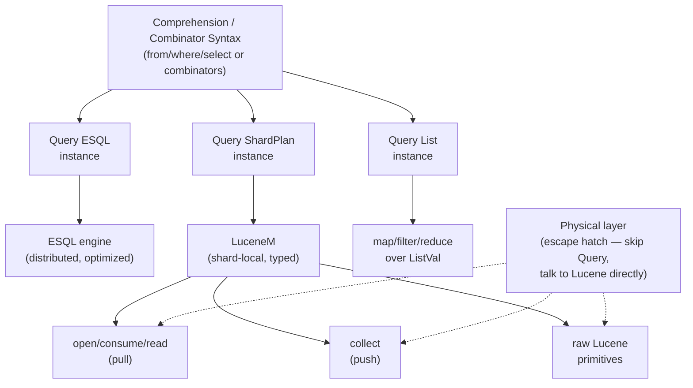

# Data Access Diagram

Architecture diagram for the [[data-access-hierarchy]]. See
[[data-access-rationale]] for why the equational/sequential split exists.

**Depends on**: [[data-access-hierarchy]]
**Enables**: (none directly)
**Connections**:
- part-of: [[data-access-architecture.roadmap]]
- documents: [[data-access-hierarchy]]
- documents: [[query-typeclass.data]]
